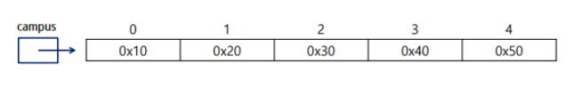
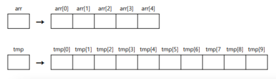

# Java

## 배열 (Array)

### 배열이란?
- 같은 종류의 데이터를 저장하기 위한 자료구조
- 크기가 고정되어 있음 (한번 생성된 배열은 크기를 바꿀 수 없음)
- 배열을 객체로 취급 (참조형)
- 배열의 요소를 참조하려면 배열 이름과 색인 (Index) 이라고 하는 음이 아닌 정수 값을 조합하여 사용 (파이썬처럼 마이너스로 접근하지 못함)
- index 번호를 가지고 각 요소에 접근
- index 번호는 0부터 시작
- 배열이름.length를 통해 배열의 길이 조회 가능
- 배열의 길이는 임의로 변경 불가능
- 길이 변경 필요시 새로운 배열을 생성 후 내용을 옮긴다



### 배열의 선언
- 타입[] 변수
- 타입 변수[]

| 타입 | 배열 이름 | 선언 |
| -- | -- | -- |
| int | iArr | int[] iArr; |
| char | cArr | char[] cArr; |
| boolean | bArr | boolean[] bArr; |
| String | strArr | String[] strArr; |
| Date | dateArr | Date[] dateArr; |

### 배열의 생성 및 초기화

```java
자료형[] 배열이름 = new자료형[길이]; //배열 생성(자료형의 초기값으로 초기화)
자료형[] 배열이름 = new 자료형[] {값1, 값2, 값3, 값4}; //배열 생성 및 값 초기화
자료형[] 배열이름 = {값1, 값2, 값3, 값4}; //선언과 동시에 초기화

int[] score1;
int score2[];
int[] score3 = new int[5];
int[] score4 = new int[] {1, 2, 3, 4};
int[] score5 = {1, 2, 3, 4,};

score3 = new int[6];
score3 = new int[] {1, 2, 3, 4, 5};
score3 = {1, 2, 3, 4, 5}; // 오류 발생
```

| 자료형 | 기본값 | 비고 |
| boolean | false | |
| char | \u0000 | 공백문자 |
| byte, short, int | 0 | |	 
| long | 0L | |
| float | 0.0f | |
| double | 0.0 | |
| 참조형 변수 | null | 아무것도 참조하지 않음 |

### 배열의 순회
- 반복문을 이용하여 배열의 요소를 순회할 수 있음

```java
int intArray[] = {1, 3, 5, 7, 9};
for (int i=0; i <intArray.length; i++) {
    System.out.println(intArray[i]);
}
```

- 배열 요소에 직접 접근하여 순회하는 for-each 구문
- 가독성이 개선된 반복문, 배열 및 collections에서 사용 가능
- index 대신 직접 요소 (elements)에 접근하는 변수를 제공
- naturally read only (copied value)

```java
int intArray[] = {1, 3, 5, 7, 9};
for (int x: intArray) { //intArray에 들어있는 x 값에 대하여
    System.out.println(x);
}
```

### 배열의 출력
- 반복문을 이용해서 출력
- Arrays.toString(배열): 배열 안의 요소를 [값1, 값2, …] 형태로 출력

### 배열의 복사
- 배열은 생성하면 길이를 변경할 수 없기 때문에 더 많은 저장공간이 필요하다면 큰 배열을 생성하고 이전 배열의 값을 복사해야 함



```java
새로운 배열 = Arrays.copyOf(복사하고 싶은 배열, 새로운 배열의 크기)
System.arraycopy(Object src, intsrcPos, Object dest, int destPos, int length)
```

## 다차원 배열 (Multidimensional Array)

### 다차원 배열이란?
- 2차원 이상의 배열을 의미
- 배열 요소로 또 다른 배열을 가지는 배열
- 2차원 배열은 배열 요소로 1차원 배열의 참조를 가지는 배열
- 3차원 배열은 배열 요소로 2차원 배열의 참조를 가지는 배열

### 2차원 배열 선언

```java
int [][] iArr
int iArr[][]
int[] iArr[]
```

### 2차원 배열 생성

```java
배열의 이름 = new 배열유형[1차원 배열개수][1차원 배열의 크기];
배열의 이름 = new 배열유형[1차원 배열개수][];
```