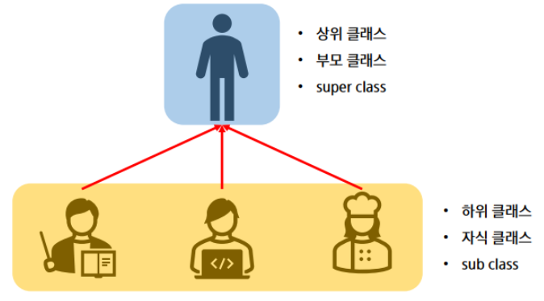
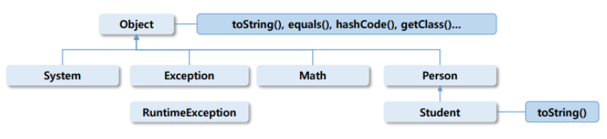

# Java

## 상속 (Inheritance)

### 상속이란?
- 어떤 클래스의 특성을 그대로 갖는 새로운 클래스를 정의한 것



- 조상클래스의 상속을 받아 만든 하위, 자식 클래스


```java
public class Person {
    String name;
    int age;
    public void eat() {
        System.out.println("음식을 먹는다.");
    }
}
```


```java
public class Student {
    String name;
    int age;
    String major;
    public void eat() {
        System.out.println("음식을 먹는다.");
    }
    public void study() {
        System.out.println("공부를 한다.");
    }
}
```

```java
public class Student extends Person {
    String major;
    public void study() {
        System.out.println("공부를 한다.");
    }
}
```

- extends라는 키워드를 이용해서 Person 클래스를 상속받으면 Student에서 Person에 있는 속성들을 사용할 수 있다.

### 상속의 특징
1. 확장성, 재사용성
    - 부모의 생성자와 초기화 블록은 상속 X

2. 클래스 선언 시 extends 키워드를 명시
    - 자바는 다중 상속 허용 X, 단일 상속 지원?

3. 관계
    - 부모 (상위, Super) 클래스: Person
    - 자식 (하위, Sub) 클래스: Student

4. 자식 클래스는 부모 클래스의 멤버 변수, 메소드를 자신의 것처럼 사용할 수 있다. (단, 접근 제한자에 따라 사용 여부가 달라진다.)

5. Object 클래스는 모든 클래스의 조상 클래스
    - 별도의 extends 선언이 없는 클래스는 extends Object가 생략되어 있다는 뜻

6. super 키워드
    - super를 통해 조상 클래스의 생성자 호출

### 오버라이딩 (overriding)
- 상위 클래스에 선언된 메서드를 자식 클래스에서 재정의하는 것
- 메서드의 이름, 반환형, 매개변수 (타입, 개수, 순서)가 동일해야 한다.
- 하위 클래스의 접근제어자 범위가 상위 클래스보다 크거나 같아야 한다.
- 조상보다 더 큰 예외를 던질 수 없다.
- 메서드 오버로딩(overloading)과 혼동하지 말 것

### Object 클래스
- 가장 최상위 클래스로 모든 클래스의 조상
- Object의 멤버는 모든 클래스의 멤버



```java
System.out.println(person.toString()); // Object의 toString 사용
System.out.println(student.toString()); // Student의 toString 사용
```

### toString
- 객체를 문자열로 변경하는 메서드

```java
public String toString() {
    return getClass().getName() + "@" + Integer.toHexString(hashCode());
}
```

- 주소값이 아닌 내용을 반환한다.

```java
public String toString() {
    return "Student [name=" + name + ", age=" + age + ", major=" + major + "]";
}
```