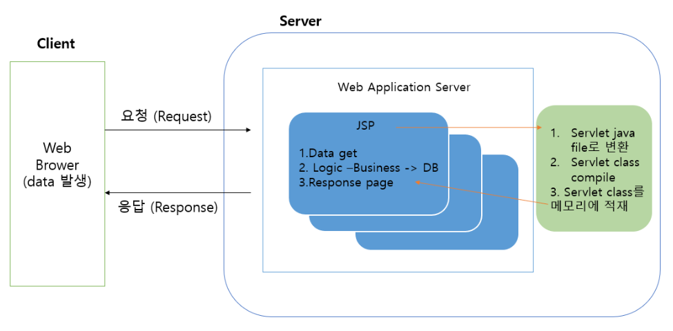

# BackEnd

## JSP (Java Server Page)

### JSP란?
- JSP는 HTML 내에 자바 코드를 삽입하여 웹 서버에 동적으로 웹페이지를 생성하여 웹브라우저를 돌려주는 언어
- Java EE 스펙 중 하나로 웹 어플리케이션 서버에서 동작함
- JSP는 실행시에 자바 서블릿으로 변환되어 서블릿과 거의 유사하다. 하지만 서블릿과 달리 HTML 표준에 따라 작성되므로 웹 디자인에 편리하다.
- 아파치 스트럿츠나 자카르타 프로젝트의 JSTL 등의 JSP 태그 라이브러리를 사용하는 경우 자바 코딩 없이 태그만으로 간략한 기술이 가능하므로 생산성을 높일 수 있다.

### JSP의 동작 흐름



- 최초로 JSP를 요청하면 JSP file로 변경될 때 JSP가 servlet으로 변경됨

`** jsp -> servlet 변환 파일 확인 경로 `
`%workspace%\.metadata\.plugins\org.eclipse.wst.server.core\tmp0\work\Catalina\localhost\[project]\org\apache\jsp`

### JSP의 스크립트 요소
1. 선언: 멤버 변수 선언이나 메소드를 선언하는 영역

```java
// 형식
<%! 멤버변수와 method 작성%>
```

2. 스크립트릿: Client 요청 시 호출되는 영역으로 Servlet으로 변환 시 service() method에 해당되는 영역이며 request, response에 관련된 코드를 구현하는 곳

```java
// 형식
<%
자바코드 작성
%>
```

3. 표현식: 데이터를 브라우저에 출력할 때 사용
- 문자열 뒤에 세미콜론을 작성하면 안된다.
- <%= 문자열 %>이랑 <% out.println(문자열); %>이랑 같은 표현이다.

```java
// 형식
<%= 문자열 %>
```

4. 주석: 코드 상에 부가 설명을 작성

```java
<!-- HTML 주석 -->
<%-- JSP 주석 -->
```

### JSP의 지시자
1. page Directive
    - 컨테이너에게 현재 JSP 페이지를 어떻게 처리할 것인지에 대한 정보를 제공

| 속성 | 기본값 | 설명 |
| -- | -- | -- |
| language | java | 스크립트에 사용할 언어 지정 |
| info | | 현재 JSP 페이지의 설명 |
| contentType |	text/html;charset=UTF-8 | 브라우저에 내보내는 내용의 MIME 형식 지정 및 문자 집합 지정 |
| pageEncoding | UTF-8 | 현재 JSP 페이지 문자집합 지정 |
| import | | 현재에 import할 java 패키지나 클래스 |
| session |	true | 세션의 유무 사용 설정 |
| errorPage | | 에러가 발생할 때 대신 처리될 JSP 페이지 지정 |
| isErrorPage | false | 현재 JSP 페이지가 에러 핸들링 하는 페이지인지를 지정하는 요소 |

2. include Directive
    - 특정 jsp file을 페이지에 포함
    - 여러 jsp 페이지에서 반복적으로 사용되는 부분을 jsp file로 만든 후 반복 영역에 include 시킬 수 있음

3. taglib Directive
    - JSTL 또는 사용자에 의해서 만든 커스텀 태그를 이용할 때 사용
    - JSP 페이지 내에 불필요한 자바 코드를 줄일 수 있음

```java
// 1. page Directive
<%@ page attr1="val1" attr2="val2" %>

// 2. include Directive
<%@ include file ="/template/header.jsp" %>

// 3. taglib Directive
<%@ taglib prefix="c" uri="http://java.sun.com/jsp/jstl/core" %>
```

### JSP의 기본 객체
1. JSP의 기본 객체


2. JSP 기본객체의 영역

| 기본 객체 | 설명 |
| -- | -- |
| pageContext | 하나의 JSP 페이지를 처리할 때 사용되는 영역. 한번의 클라이언트 요청에 대하여 하나의 JSP 페이지가 호출되며 이 때 단 한개의 page 객체만 대응이 됨. 페이지 영역에 저장한 값은 페이지를 벗어나면 사라짐. 커스텀 태그에서 새로운 변수를 추가할 때 사용함 |
| request |	하나의 HTTP 요청을 처리할 때 사용되는 영역. 웹 브라우저가 요청을 할 때마다 새로운 request 객체가 생성됨. request 영역에 저장한 속성은 그 요청에 대한 응답이 완료되면 사라짐. |
| session |	하나의 웹 브라우저와 관련된 영역으로 같은 웹 브라우저 내에서 요청되는 페이지들은 같은 session들을 공유하게됨 -> 로그인 정보 등을 저장 |
| application |	하나의 웹 어플리케이션과 관련된 영역이며 웹 어플리케이션 1개의 application 객체가 생성됨. 같은 웹 어플리케이션에서 요청되는 페이지들은 같은 applicatin 객체를 공유함 |

3. 공통 method
- servlet과 jsp 페이지 간에 특정 정보를 주고 받거나 공유하기 위한 메소드를 지원

| method | 설명 |
| -- | -- |
| void setAttribute(String name, Object value) | 문자열 name 이름으로 Object형 데이터를 저장. Object형이므로 어떠한 Java 객체도 저장이 가능 |
| Object getAttribute(String name) | 문자열 name에 해당하는 속성 값이 있다면 Object 형태로 가져오고 없으면 null을 리턴. 따라서 리턴 값에 대한 적절한 형 변환이 필요 |
| Enumeration getAttributeNames() |	현재 객체에 저장된 속성들의 이름들을 Enumeration 형태로 가져옴 |
| void removeAttribute(String name) | 문자열 name에 해당하는 속성을 삭제함. |

### WEB Page 이동

| | forward(request, response) | sendRedirect(location) |
| -- | -- | -- |
| 사용 방법 | RequestDispatcher dispatcher = request.getRequestDispatcher(path); dispatcher.forward(request, response); | response.sendRedirect(location); |
| 이동 범위 | 동일 서버(project) 내 경로 | 동일 서버 포함 타 URL 가능 |
| location bar | 기존 URL 유지 (실제 이동되는 주소 확인 불가) |	이동하는 page로 변경 |
| 객체 | 기존의 request와 response가 그대로 전달 | 기존의 request와 response는 소멸되고 새로운 request와 response가 생성됨. |
| 속도 | 비교적 빠름 | forward()에 비해 느림 |
| 데이터 유지 |	request의 setAttribute(name, value)를 통해 전달 | request로는 data 저장 불가능 session이나 cookie를 이용 |