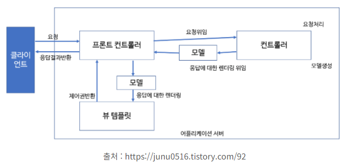

# BackEnd

## MVC Pattern

### Model
- 동작을 수행하는 코드
- 사용자 View에 어떻게 보일지에 대해서 신경 X
- 데이터 질의에 대한 정보를 제공하는 기능 및 데이터에 대한 수정을 담당

### View
- 사용자가 화면에 무엇을 어떻게 볼 것인지를 결정
- 사용자 화면에 보이는 부분
- 모델의 정보를 받아와 사용자에게 보여주는 역할 수행
- 자체적으로 모델의 정보를 보관 X

### Controller
- 모델과 뷰를 연결하는 역할
- 사용자에게 데이터를 가져오고 수정하고 제공함

### Spring Web MVC
- 다른 프레임워크와 마찬가지로 front controller pattern으로 구성됨
- 중심이 되는 DispatcherServlet(front controller)은 요청처리를 위한 기능을 제공

### Spring Web MVC
- Servlet API를 기반으로 구축된 웹프레임워크
- Spring Framework이 제공하는 DI, AOP 뿐 아니라, WEB 개발을 위한 기능을 제공
- DispatcherServlet(FrontController)를 중심으로 디자인 되었으며, View Resolver, Handler Mapping, Controller와 같은 객체와 함께 요청을 처리하도록 구성

### Spring MVC 구성요소
- DispatcherServlet -> 클라이언트 요청처리(요청 및 처리 결과 전달)
- HandlerMapping -> 요청을 어떤 Controller가 처리할 지 결정
- Controller -> 요청에 따라 수행할 메서드를 선언하고, 요청처리를 위한 로직 수행(비즈니스 로직 호출)
- ModelAndView -> 요청처리를 하기 위해서 필요한 혹은 그 결과를 저장하기 위한 객체
- ViewResolver -> Controller에 선언된 view이름을 기반으로 결과를 반환할 View를 결정
- View -> 응답화면 생성

### Spring MVC - 요청 처리 흐름
1. 클라이언트 요청이 들어오면 DispatcherServlet이 받는다.
2. 
3. 
4. 
5. 
6. 
7. 
8. 