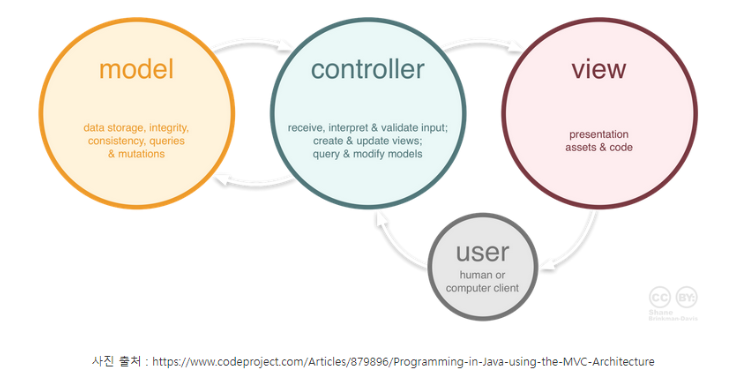
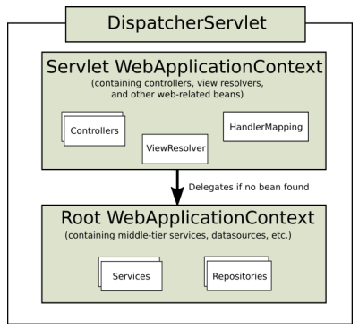

# Spring

## MVC Pattern

### MVC란?

- MVC는 Model-View-Controller의 약자이며, 어플리케이션을 구성하는 요소를 역할에 따라 세 가지 모듈로 나누어 구분한 패턴이다.

### Model

- 어플리케이션의 데이터이며, 모든 데이터 정보를 가공하여 가지고 있는 컴포넌트이다.
- 사용자가 이용하려는 모든 데이터를 가지고 있어야하며, View 또는 Controller에 대해 어떠한 정보도 알 수 없어야 한다.
- 변경이 일어나면 처리 방법을 구현해야한다.

### View

- 시각적인 UI 요소를 지칭하는 용어이다.
- 사용자 화면에 보이는 부분
- 모델의 정보를 받아와 사용자에게 보여주는 역할 수행
- 자체적으로 모델의 정보를 보관 X

### Controller

- 모델과 뷰를 연결하는 역할
- 사용자에게 데이터를 가져오고 수정하고 제공함

### Spring WEB MVC

- 다른 프레임워크와 마찬가지로 front controller pattern으로 구성됨
- Servlet API를 기반으로 구축된 웹프레임워크
- Spring Framework이 제공하는 DI, AOP 뿐 아니라, WEB 개발을 위한 기능을 제공
- DispatcherServlet(FrontController)를 중심으로 디자인 되었으며, View Resolver, Handler Mapping, Controller와 같은 객체와 함께 요청을 처리하도록 구성
- 중심이 되는 DispatcherServlet(front controller)은 요청처리를 위한 기능을 제공

- 위 사진의 구조와 역할을 간단히 살펴보면, 프론트 컨트롤러(Front Controller)가 우선적으로 클라이언트로부터 모든 요청을 받게 되며, 실제 요청의 처리는 개별 컨트롤러 클래스로 위임을 한다. (일종의 중앙처리장치와 같은 것으로 요청이 들어오면 WAS가 개별 서블릿에 해당 요청에 대한 처리를 위임하는 논리와 비슷하다)

### Spring MVC 실제 동작 구조

### DispatcherServlet

- 사용자의 모든 요청을 받아 처리한다.
- 프론트 컨트롤러에 해당하는 역할을 수행하며 Request를 각각의 Controller에게 위임한다.

### Spring MVC 구성요소

- DispatcherServlet -> 클라이언트 요청처리(요청 및 처리 결과 전달)
- HandlerMapping -> 요청을 직접 처리할 컨트롤러를 탐색한다. 구체적인 mapping은 xml 파일이나 java config 관련 어노테이션 등을 통해 처리할 수 있다.
- HandlerAdapter -> 매핑된 컨트롤러의 실행을 요청한다.
- Controller -> 직접 요청을 처리하며, 처리 결과를 반환한다. 결과가 반환되면 HandlerAdapter가 ModelAndView 객체로 변환되며, 여기에는 View Name과 같이 응답을 통해 보여줄 View에 대한 정보와 관련된 데이터가 포함되어 있다.
- ModelAndView -> 요청처리를 하기 위해서 필요한 혹은 그 결과를 저장하기 위한 객체
- ViewResolver -> View Name을 확인한 후, 실제 컨트롤러로부터 받은 로직 처리 결과를 반영할 View 파일 (jsp)을 탐색한다.
- View -> 로직 처리 결과를 반영한 최종 화면을 출력한다.

### Spring MVC - 요청 처리 흐름

1. 클라이언트가 서버에 요청을 하면, front controller인 DispatcherServlet 클래스가 요청을 받는다.
2. DispatcherServlet은 프로젝트 파일 내의 servlet-context.xml 파일의 @Controller 인자를 통해 등록한 요청 위임 컨트롤러를 찾아 매핑(mapping)된 컨트롤러가 존재하면 @RequestMapping을 통해 요청을 처리할 메서드로 이동한다.
3. 컨트롤러는 해당 요청을 처리할 Service를 받아 비즈니스 로직을 서비스에게 위임한다.
4. Service는 요청에 필요한 작업을 수행하고, 요청에 대해 DB에 접근해야 한다면 DAO에 요청하여 처리를 위임한다.
5. DAO는 DB정보를 DTO를 통해 받아 서비스에게 전달한다.
6. Service는 전달받은 데이터를 컨트롤러에게 전달한다.
7. 컨트롤러는 Model 객체에게 요청에 맞는 View 정보를 담아 DispatcherServlet에게 전송한다.
8. DispatcherServlet은 ViewResolver에게 전달받은 View 정보를 전달한다.
9. ViewResolver는 응답할 View에 대한 JSP를 찾아 DispatcherServlet에게 전달한다.
10. DispatcherServlet은 응답할 View의 Render를 지시하고 View는 로직을 처리한다.
11. DispatcherServlet은 클라이언트에게 Rending된 View를 응답하며 요청을 마친다.
