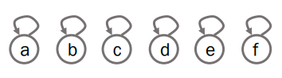
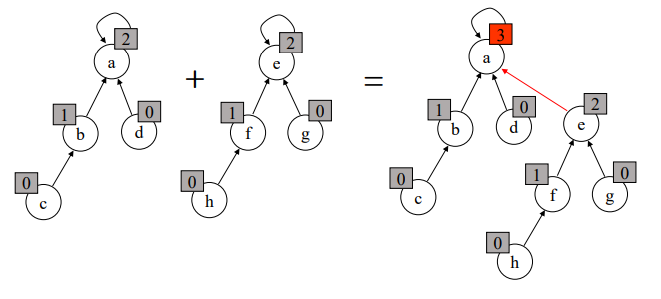
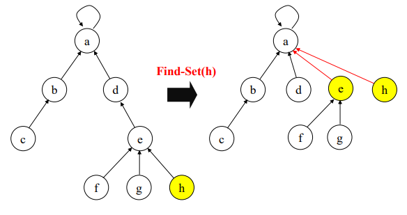
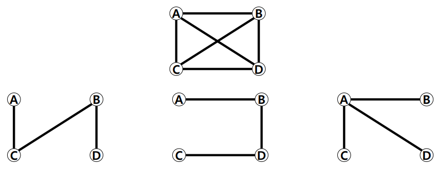
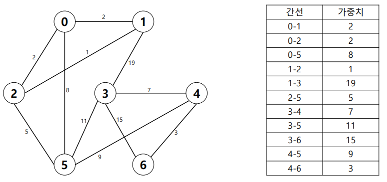
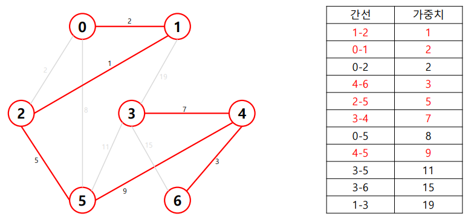

# APS 기본

## 서로소 집합 (Disjoint sets)
- 서로소 또는 상호배타 집합들은 서로 중복 포함된 원소가 없는 집합들이다.
- 집합에 속한 하나의 특정 멤버를 통해 각 집합들을 구분한다.
- 특정 멤버: 대표자(Representative)

### 상호배타 집합 표현 방법
- 연결 리스트
- 트리

### 상호배타 집합 연산


- Make-Set(x) -> 유일한 멤버 x를 포함하는 새로운 집합을 생성

```java
p[x] // 노드 x의 부모 저장
rank[x] // 루트 노드가 x인 트리의 랭크 값 저장
Make_Set(x) {
	p[x] = x;
	rank[x] = 0;
}
```

- Find-Set(x) -> x를 포함하는 집합 찾기 (집합의 대표자 반환)

```java
Find_Set(x) {
	if (x != p[x]) p[x] = Find_Set(p[x]);
	return p[x];
}
```

- Union(x, y) -> x와 y를 포함하는 두 집합을 통합하는 연산 (합집합)

```java
Union(x, y) {
	Link(Find_Set(x), Find_Set(y))
}
Link(x, y) {
	if (rank[x] > rank[y]) p[y] = x;
	else {
		p[x] = y
		if (rank[x] == rank[y]) rank[y]++;
	}
}
```

### 상호배타 집합 (연결 리스트)
- 같은 집합의 원소들은 하나의 연결리스트로 관리한다.
- 연결리스트의 맨 앞의 원소를 집합의 대표 원소로 삼는다.
- 각 원소는 집합의 대표원소를 가리키는 링크를 갖는다.

### 상호배타 집합 (트리)
- 하나의 집합(a disjoint set)을 하나의 트리로 표현한다.
- 자식 노드가 부모 노드를 가리키며 루트 노드가 대표자가 된다.
- e.g.
  - Make-Set(a) ~ Make-Set(f) <br>
  
  - Union(c, d), Union(e, f) <br>
  
  - Union(d, f) <br>
  
  - Find-Set(d) -> return c / Find-Set(e) return c

### 문제점
- 동일한 대표자를 가지고 있는 경우 Find-Set을 호출할 때마다 불필요한 연산이 발생한다.

### 연산 효율 높이기
1. Rank를 이용한 Union
  - 각 노드는 자신을 루트로 하는 subtree의 높이를 랭크(rank)라는 이름으로 저장한다.
  - 두 집합을 합칠 때 rank가 낮은 집합을 rank가 높은 집합에 붙인다.
2. Path compression
  - Find-Set을 행하는 과정에서 만나는 모든 노드들이 직접 root를 가리키도록 포인터를 바꿔 준다.

### 랭크를 이용한 Union



### Path Compression을 이용한 Union


## 최소 신장 트리

### 신장 트리
- 그래프의 모든 정점과 간선의 부분 집합으로 구성되는 트리


### 최소 신장 트리
- 신장 트리 중에서 사용된 간선들의 가중치 합이 최소인 트리
- 무방향 가중치 그래프
- 그래프의 가중치의 합이 최소
- N개의 정점을 가지는 그래프에 대해 반드시 (N - 1)개의 간선을 사용
- 사이클을 포함해서는 안된다.

## 크루스칼 알고리즘
- 간선을 하나씩 선택해서 MST를 찾는 알고리즘
1. 최초, 모든 간선을 가중치에 따라 **오름차순**으로 정렬
2. 가중치가 가장 낮은 간선부터 선택하면서 트리를 증가키심 (**사이클이 존재하면 다음으로 가중치가 낮은 간선 선택**)
3. **n - 1개의 간선**이 선택될 때 까지 2를 반복

### 최초 상태


### 오름차순 정렬


### 2 ~ 3번 과정 반복


### 구현

```java
import java.util.*;

class 크루스칼알고리즘 {
    static int[] p; // 대표를 저장할 배열

    static int findSet(int x) {
        // 기본 방법 (효율성 떨어짐)
//        if (x == p[x]) return x;
//        return findSet(p[x]);
        // Pass Compression
        if (x != p[x]) p[x] = findSet(p[x]);
        return p[x];
    }

    static void union(int x, int y) {
        p[y] = x; // x의 대표를 y의 대표로 넣는다. rank 고려 X
    }

    public static void main(String[] args) {
        Scanner sc = new Scanner(System.in);

        int V = sc.nextInt(); // 정점의 수, 0부터 시작
        int E = sc.nextInt(); // 간선의 수

        // 2차원 배열을 이용한 간선배열 저장 ([0]: 시작정점, [1]: 끝정점, [2]: 가중치)
        int[][] edges = new int[E][3];

        for (int i = 0; i < E; i++) {
            edges[i][0] = sc.nextInt();
            edges[i][1] = sc.nextInt();
            edges[i][2] = sc.nextInt();
        }
        // 크루스칼 1단계: 간선 오름차순 정렬 (Comparator 인터페이스 사용)
        Arrays.sort(edges, new Comparator<int[]> () {
            @Override
            public int compare(int[] o1, int[] o2) {
                return o1[2] - o2[2];
            }
        });
        // 크루스칼 2단계: V - 1개의 간선 뽑기 (사이클 발생 X)
        p = new int[V];
        for (int i = 0; i < V; i++) {
            p[i] = i;
        }
        // 2-2: 검사하면서 뽑기
        int ans = 0; // 최소비용
        int pick = 0; // 뽑은 간선의 수

        for (int i = 0; i < E; i++) {
            // i번째 간선을 이용해 두개의 정점을 가지고 처리
            int px = findSet(edges[i][0]);
            int py = findSet(edges[i][1]);

            if (px != py) { // findSet 결과가 다르면 사이클 형성이 되지 않는다.
                union(px, py);
                ans += edges[i][2];
                pick++;
            }
            if (pick == V - 1) break;
        }
        System.out.println(ans);
    }
}
```