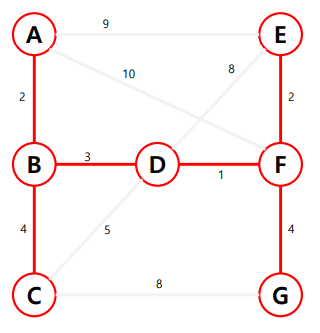

# APS 기본

## 프림 (Prim)
- 하나의 정점에서 연결된 간선들 중에 하나씩 선택하면서 MST를 만들어 가는 방식
    1. 임의 정점을 하나 선택해서 시작
    2. 선택한 정점과 인접하는 정점들 중의 최소 비용의 간선이 존재하는 정점을 선택
    3. 모든 정점이 선택될 때 까지 1, 2 과정을 반복
- 서로소인 2개의 집합 (2 disjoint-sets) 정보를 유지
    - 트리 정점들(tree vertices) - MST를 만들기 위해 선택된 정점들
    - 비트리 정점들(nontree vertices) - 선택 되지 않은 정점들
  



### 프림 구현(반복문)

```java
import java.util.*;

class Prim {
    static final int INF = Integer.MAX_VALUE;

    public static void main(String[] args) {
        Scanner sc = new Scanner(System.in);

        int V = sc.nextInt(); // 정점 수
        int E = sc.nextInt(); // 간선 수

        // 인접 행렬
        int[][] adjArr = new int[V][V];

        for (int i = 0; i < E; i++) {
            int A = sc.nextInt();
            int B = sc.nextInt();
            int W = sc.nextInt();

            adjArr[A][B] = W;
            adjArr[B][A] = W;
        }

        // 정점은 뽑혔거나 안뽑혔거나 두가지 상태
        boolean[] visited = new boolean[V];

        int[] p = new int[V]; // 대표자
        int[] dist = new int[V]; // key값을 저장

        for (int i = 0; i < V; i++) {
            p[i] = -1;
            dist[i] = INF;
        }

        // 임의의 시작 정점을 선택
        dist[0] = 0;

        int ans = 0;

        for (int i = 0; i < V; i++) {
            // 1. 가장 작은 값을 뽑는다.
            int min = INF;
            int idx = -1;
            // 반복문을 돌면서 아직 안뽑은 정점을 선택한다.
            for (int j = 0; j < V; j++) {
                if (!visited[j] && dist[j] < min) {
                    min = dist[j];
                    idx = j;
                }
            }
            visited[idx] = true;
            ans += dist[idx];
            // 2. 뽑은 정점과 인접한 정점들 최소값 갱신
            for(int j = 0; j < V; j++) {
                if (!visited[j] && adjArr[idx][j] != 0 && dist[j] > adjArr[idx][j]) {
                    dist[j] = adjArr[idx][j];
                    p[j] = idx;
                }
            }
        }
    }
}
```

### 프림 구현 (우선순위 큐)

```java
import java.util.*;

class Prac {
    static final int INF = Integer.MAX_VALUE;

    static class Edge implements Comparable<Edge> {
        int st, ed, w;
        public Edge(int st, int ed, int w) {
            this.st = st;
            this.ed = ed;
            this.w = w;
        }

        public int compareTo(Edge o) {
            return this.w - o.w;
        }
    }

    public static void main(String[] args) {
        Scanner sc = new Scanner(System.in);

        int V = sc.nextInt(); // 정점 수
        int E = sc.nextInt(); // 간선 수

        // 인접 리스트
        List<Edge>[] adjList = new ArrayList[V];

        // 리스트 생성
        for (int i = 0; i < V; i++) {
            adjList[i] = new ArrayList<>();
        }

        for (int i = 0; i < E; i++) {
            int A = sc.nextInt();
            int B = sc.nextInt();
            int W = sc.nextInt();

            adjList[A].add(new Edge(A, B, W));
            adjList[B].add(new Edge(B, A, W));

        }

        // 방문 처리
        boolean[] visited = new boolean[V];

        PriorityQueue<Edge> pq = new PriorityQueue<>();

        // 시작 정점을 하나 뽑은 후 넣고 시작
        visited[0] = true;

        pq.addAll(adjList[0]);

        int pick = 1;
        int ans = 0;

        while(pick != V) {
            Edge e = pq.poll();

            if(visited[e.ed]) continue;

            ans += e.w;
            pq.addAll(adjList[e.ed]);
            visited[e.ed] = true;
            pick++;
        }
    }
}
```

## 다익스트라 (Dijkstra)
- 시작 정점에서 거리가 최소인 정점을 선택해 나가면서 최단 경로를 구하는 방식이다.
- 탐욕 기법을 사용한 알고리즘으로 MST의 프림 알고리즘과 유사하다.
- 시작 정점(s)에서 끝 정점(t) 까지의 최단 경로에 정점 x가 존재한다.
- 이때, 최단 경로는 s에서 x까지의 최단 경로와 x에서 t까지의 최단 경로로 구성된다.
- s -> t 까지의 최단 경로 = s -> x 까지 최단 경로 + x -> t 까지 최단 경로


### 동작 과정
1. 시작 정점을 입력 받는다.
2. 거리를 저장할 D배열을 큰 값으로 초기화한 후 시작점에서 갈 수 있는 곳의 값은 바꿔 놓는다.
3. 아직 방문하지 않은 점들이 가지고 있는 거리 값과 현재 정점에서 방문하지 않은 정점까지의 가중치의 합이 작다면 변경하여 적는다.
4. 모든 정점을 방문할 때까지 반복

### 다익스트라 구현

```java
import java.util.*;

class Prac {
    static class Node {
        int v, w;
        public Node(int v, int w) {
            this.v = v;
            this.w = w;
        }
    }
    static final int INF = Integer.MAX_VALUE;
    // 인접 리스트
    static int V, E; // V: 정점의 수, E: 간선의 수
    static List<Node>[] adjList;
    static int[] dist; // 최단 길이 저장 배열

    public static void main(String[] args) {
        Scanner sc = new Scanner(System.in);

        int V = sc.nextInt(); // 정점 수
        int E = sc.nextInt(); // 간선 수

        adjList = new ArrayList[V];
        // 리스트 생성
        for (int i = 0; i < V; i++) {
            adjList[i] = new ArrayList<>();
        }

        dist = new int[V];
        Arrays.fill(dist, INF);

        for (int i = 0; i < E; i++) {
            int A = sc.nextInt(); // 시작 정점
            int B = sc.nextInt(); // 도착 정점
            int W = sc.nextInt(); // 가중치

            // 유향 그래프
            adjList[A].add(new Node(B, W));

        }

        dijkstra(0);

    }

    static void dijkstra(int start) {
        boolean[] visited = new boolean[V];

        dist[start] = 0; // 시작 정점까지의 거리는 0으로 초기화

        for (int i = 0; i < V - 1; i++) {
            int min = INF;
            int idx = -1;

            // 선택하지 않은 정점 중 dist가 가장 작은 값을 골라
            for (int j = 0; j < V; j++) {
                if (!visited[j] && min > dist[j]) {
                    min = dist[j];
                    idx = j;
                }
            }

            if (idx == -1) break; // 선택할 수 있는 정점이 없다.

            visited[idx] = true; // 선택

            for (int j = 0; j < adjList[idx].size(); j++) {
                Node curr = adjList[idx].get(j);

                if(!visited[curr.v] && dist[curr.v] > dist[idx] + curr.w) {
                    dist[curr.v] = dist[idx] + curr.w;
                }
            }
        }
    }
}
```