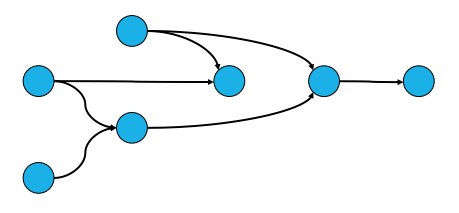
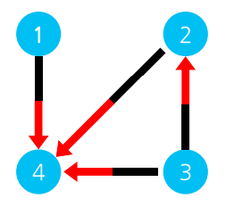

# APS 기본

## 위상 정렬
- **순서가 있는 작업**을 차례로 진행해야 할 때 순서를 결정해 주기 위해 사용
- **사이클이 없는 방향 그래프**의 모든 노드를 주어진 방향성에 어긋나지 않게 순서를 나열

### DAG (Directed Acyclic Graph)



- 유향 비사이클 그래프



- 진입 차수 (in-degree): 특정 노드로 **들어오는** 간선의 개수
- 진출 차수 (out-degree): 특정 노드에서 **나가는** 간선의 개수
- 위상 정렬에서는 진입 차수가 중요 (진입 차수가 0인 노드들은 순서에 구애받지 않는다.)

| 정점 | 1 | 2 | 3 | 4 |
| -- | -- | -- | -- | -- |
| 진입 차수 | 0 | 1 | 0 | 3 |
| 진출 차수 | 1 | 1 | 2 | 0 |

### 위상 정렬 (Queue 구현)
1. 진입 차수가 0인 모든 노드를 Queue에 삽입
2. Queue가 공백상태가 될 때까지 반복 수행
	1. Queue에서 원소를 꺼내 해당 노드에서 나가는 간선을 그래프에서 제거한다. (연결 된 노드의 진입 차수를 감소 시킨다.)
	2. 새롭게 진입 차수가 0이 된 노드를 Queue에 삽입한다.

### 구현

```java
import java.util.*;

class 위상정렬_Queue구현 {

    public static void main(String[] args) {
        Scanner sc = new Scanner(System.in);

        int V = sc.nextInt(); // 정점 수
        int E = sc.nextInt(); // 간선 수

        // 인접 행렬
        int[][] adjArr = new int[V + 1][V + 1];
		// 진입 차수
        int[] degree = new int[V + 1];

        for (int i = 0; i < E; i++) {
            int A = sc.nextInt();
            int B = sc.nextInt();

            // 유향 그래프
            adjArr[A][B] = 1; // 가중치가 따로 없으면 1
            // 진입차수 증가
            degree[B]++;
        }

        Queue<Integer> queue = new LinkedList<>();

        // 진입차수가 0인 정점들만 큐에 넣을 수 있다.
        for (int i = 1; i < V + 1; i++) {
            if (degree[i] == 0) queue.add(i);
        }

        while (!queue.isEmpty()) {
            int work = queue.poll(); // 큐에서 정점 꺼내기

            for (int i = 1; i < V + 1; i++) {
                if (adjArr[work][i] == 1) { // 정점과 연결된 인접 정점들
                    adjArr[work][i] = 0; // 간선 제거
                    degree[i]--; // 해당 정점과 연결된 인접 정점들 진입 차수 -1

                    if (degree[i] == 0) queue.add(i); // 인접 정점의 진입 차수가 0이면 큐에 넣기
                }
            }
        }
    }
}
```

### 위상 정렬 (Stack 구현)
1. 진입 차수가 0인 모든 노드에서 DFS 탐색 수행
2. DFS 수행
	1. 해당 노드를 방문 표시
	2. 인접하면서 방문하지 않은 노드가 있다면 DFS 재귀 호출
	3. 함수 리턴 하기 전 Stack에 현재 노드 저장
3. Stack이 공백 상태가 될 때까지 pop

- Stack에서 꺼내지는 순서를 뒤집으면 위상 정렬을 수행한 결과다.

### 구현

```java
import java.util.*;

class 위상정렬_Stack구현 {

    static int V, E; // V: 정점 수, E: 간선 수
    static int[][] adjArr; // 인접 행렬
    static int[] degree; // 진입 차수
    static boolean[] visited; // 방문 체크
    static Stack<Integer> stack = new Stack<>();

    public static void main(String[] args) {
        Scanner sc = new Scanner(System.in);

        V = sc.nextInt();
        E = sc.nextInt();

        adjArr = new int[V + 1][V + 1];
        degree = new int[V + 1];
        visited = new boolean[V + 1];

        for (int i = 0; i < E; i++) {
            int A = sc.nextInt();
            int B = sc.nextInt();

            // 유향 그래프
            adjArr[A][B] = 1; // 가중치가 따로 없으면 1
            // 진입차수 증가
            degree[B]++;
        }

        for (int i = 1; i < V + 1; i++) {
            if (degree[i] == 0) DFS(i); // 진입 차수가 0인 정점부터 DFS
        }

        while (!stack.isEmpty()) {
            // 코드 구현
        }
    }

	// DFS (깊이 우선 탐색) 메소드
    static void DFS(int v) {
        visited[v] = true; // 방문 처리

        for (int i = 1; i < V + 1; i++) {
            // 인접하지만 방문하지 않은 정점들 방문
            if (adjArr[v][i] == 1 && !visited[i])
                DFS(i);
        }

        stack.add(v); // 더 이상 깊이 들어갈 수 없으면 스택에 담기
    }
}
```

### 위상 정렬 특징
- 모든 정점을 방문하기 전에 Queue가 공백 상태가 되면 사이클이 존재하는 것이다. <br> (사이클이 존재하면 진입 차수가 0이 될 수 없음)
- 그래프의 유형은 DAG
- 여러 해답이 존재할 수 있다. <br> (진입 차수가 0인 값이 동시에 생성 된다면 작성한 코드 방법에 따라 답이 달라진다.)
- 시간 복잡도: O(V + E)

