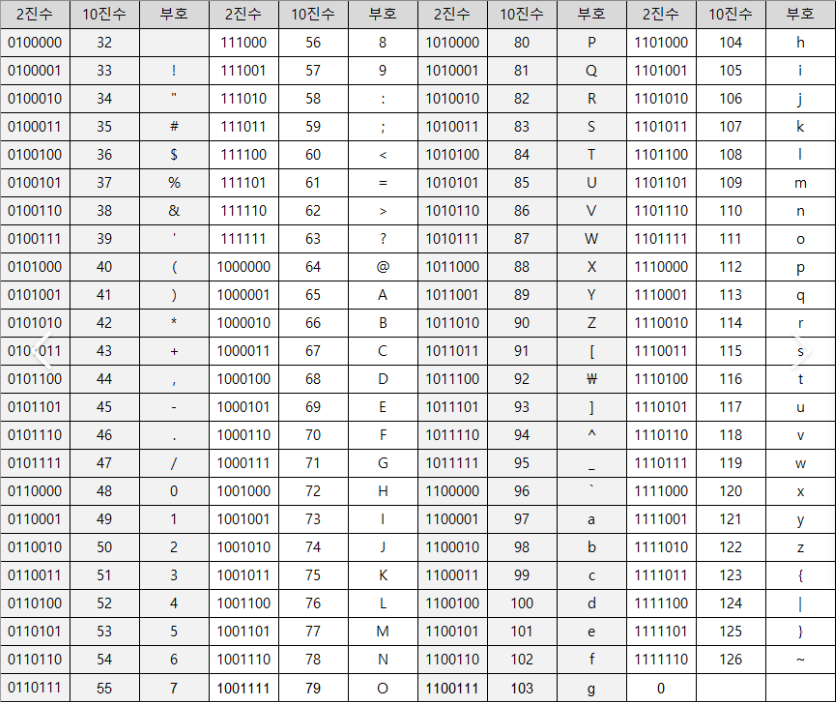

# 데이터

## 02 - 1 0과 1로 숫자를 표현하는 방법

### 정보 단위
- 0과 1을 나타내는 가장 작은 정보 단위: 비트 bit -> 2가지 정보 표현
- N개의 비트로 표현할 수 있는 정보는 2^N 가지

| | |
| -- | -- |
| 1바이트(1byte) | 8비트(8bit) |
| 1킬로바이트(1kB) | 1,000바이트(1,000byte) |
| 1메가바이트(1MB) | 1,000킬로바이트(1,000kB) |
| 1기가바이트(1GB) | 1,000메가바이트(1,000MB) |
| 1테라바이트(1TB) | 1,000기가바이트(1,000GB) |

### 워드
- CPU가 한 번에 처리할 수 있는 데이터 크기
- 만약 CPU가 한 번에 16비트를 처리할 수 있다면 1워드는 16비트가 되고, 한 번에 32비트를 처리할 수 있다면 1워드는 32비트가 된다.
- 하프 워드(half word): 워드의 절반 크기
- 풀 워드(full word): 1배 크기
- 더블 워드(double word): 2배 크기 

### 이진법
- 0과 1로 숫자를 표현하는 방식
- 일상적으로 사용하는 방식은 십진법
- 1000(2): 수학적으로 표현
- 0b1000 (binary): 코드 상에서 이진수 표현

### 이진수의 음수 표현
- 마이너스 부호를 사용하지 않고 음수를 표현한다.
- 2의 보수 구하기
    - 보수란? 어떤 수를 그보다 큰 2^N 에서 뺀 값
    - e.g. 11(2)의 2의 보수는 100(2) - 11(2) = 01(2)
    - 모든 0과 1을 뒤집고, 거기에 1을 더한 값

### 2의 보수 표현의 한계
- 0이나 2^N 형태의 이진수에 2의 보수를 취하면 원하는 음수값을 얻을 수 없다.
- e.g. 0000을 음수로 표현하기 -> 모든 0과 1 뒤집기 (1111) -> 1더하기 (10000)?

### 십육진법
- 이진법을 이용해 0과 1로 숫자를 표현하면 숫자가 너무 길어지는 단점이 발생한다.
- -> 십육진법(hexadecimal)으로 숫자를 표현
- 10, 11, 12, 13, 14, 15를 각각 A, B, C, D, E, F로 표현
- 숫자 뒤에 아래 첨자(16)을 붙이거나 숫자 앞에 0x를 붙여 구분한다.
- 15(16): 수학적으로 표현
- 0x15: 코드 상에서 십육진수 표현

## 02 - 2 0과 1로 문자를 표현하는 방법

### 문자 집합과 인코딩
- 문자 집합: 컴퓨터가 인식하고 표현할 수 있는 문자의 모음
- 문자 인코딩: 문자를 0과 1로 변환하는 과정
- 문자 디코딩: 0과 1로 이루어진 문자 코드를 사람이 이해할 수 있는 문자로 변환하는 과정

### 아스키 코드
- 영어 알파벳과 아라비아 숫자, 일부 특수 문자를 포함
- 7비트로 표현
- 2^7 = 128개의 문자를 표현할 수 있다.

- 아스키 문자 집합에 0부터 127까지의 수가 할당되어 아스키 코드로 인코딩된다.
- '0' = 48, 'A' = 65, 'a' = 97

### EUC-KR
- 한글 인코딩에는 두 가지 방식, 완성형과 조합형이 존재한다.
- 완성형 인코딩: 초성, 중성, 종성의 조합으로 이루어진 완성된 하나의 글자에 고유한 코드를 부여하는 인코딩 방식이다.
- 조합형 인코딩: 초성을 위한 비트열, 중성을 위한 비트열, 종성을 위한 비트열을 할당하여 그것들의 조합으로 하나의 글자 코드를 완성하는 인코딩 방식이다.
- EUC-KR은 KS X 1001, KS X 1003이라는 문자 집합을 기반으로 하는 대표적인 완성형 인코딩 방식이다.
- 한글 한 글자에 2바이트(16비트) 코드가 부여된다.

### 유니코드와 UTF-8
- 한글을 포함하며 대부분 나라의 문자, 특수문자, 화살표나 이모티콘까지도 코드로 표현할 수 있는 통일된 문자 집합이다.
- 현대 문자를 표현할 때 가장 많이 사용되는 표준 문자 집합이다.
- UTF-8, UTF-16, UTF-32 등의 인코딩 방식이 있다.
- UTF-8은 통상 1바이트부터 4바이트까지의 인코딩 결과를 만들어 낸다.

| 첫 코드 포인트 | 마지막 코드 포인트 | 1바이트 | 2바이트 | 3바이트 | 4바이트 |
| -- | -- | -- | -- | -- | -- |
| 0000 | 007F | 0XXXXXXX | | | |
| 0080 | 07FF | 110XXXXX | 10XXXXXX | | |
| 0800 | FFFF | 1110XXXX | 10XXXXXX | 10XXXXXX | |
| 10000 | 10FFFF | 11110XXX | 10XXXXXX | 10XXXXXX | 10XXXXXX |

- 유니코드 문자에 부여된 값의 범위가 0부터 007F(16)까지는 1바이트로 표현
- 유니코드 문자에 부여된 값의 범위가 0080(16)부터 07FF(16)까지는 2바이트로 표현
- 유니코드 문자에 부여된 값의 범위가 0800(16)부터 FFFF(16)까지는 3바이트로 표현
- 유니코드 문자에 부여된 값의 범위가 10000(16)부터 10FFFF(16)까지는 4바이트로 표현

