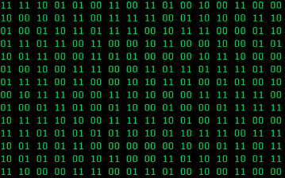
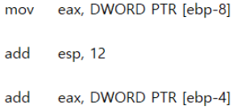

# 명령어

## 03 - 1 소스 코드와 명령어

### 고급 언어와 저급 언어
- 고급 언어: 사람이 이해하고 작성하기 쉽게 만들어진 언어
- 저급 언어: 컴퓨터가 직접 이해하고 실행할 수 있는 언어
- 고급 언어로 작성된 소스 코드가 실행되려면 반드시 저급 언어, 즉 명령어로 변환되어야 한다.
- 저급 언어에는 기계어와 어셈블리어 두 가지 종류가 있다.

### 기계어
- 0과 1의 명령어 비트로 이루어진 언어
- 이진수로 표현된 기계어

### 어셈블리어
- 0과 1로 표현된 명령어를 읽기 편한 형태로 번역한 언어
- 기계어를 읽기 편하게 만든 저급 언어일 뿐으로, 이를 이용해 복잡한 프로그램을 만드는 것은 쉽지 않아.
- 하드웨어와 밀접하게 맞닿아 있는 프로그램을 개발하는 임베디드 개발자, 게임 개발자, 정보 보안 분야 등의 개발자가 많이 사용한다.

### 컴파일 언어
- 컴파일러에 의해 소스 코드 전체가 저급 언어로 변환되어 실행되는 고급 언어
- 대표적인 컴파일 언어로는 C가 있다.
- 컴파일: 컴파일 언어로 작성된 소스 코드가 저급 언어로 변환되는 과정
- 컴파일러: 컴파일을 수행해 주는 도구
- 소스 코드 내에 오류가 하나라도 존재하면 컴파일이 불가능하다.

### 인터프리터 언어
- 인터프리터에 의해 소스 코드가 한 줄씩 실행되는 고급 언어
- 대표적인 인터프리터 언어로는 Python이 있다.
- 소스 코드를 한 줄씩 차례로 실행한다.
- 인터프리터: 소스 코드를 한 줄씩 저급 언어로 변환하여 실행해 주는 도구
- 소스 코드 N번째 줄에 문법 오류가 있더라도 N-1번째 줄까지는 올바르게 수행된다.

### 목적 파일 vs 실행 파일
- 목적 파일: 목적 코드(컴퓨터가 이해하는 저급 언어)로 이루어진 파일
- 실행 파일: 실행 코드로 이루어진 파일

