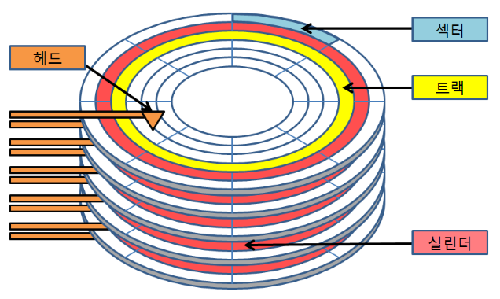
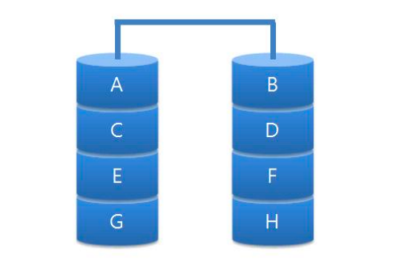
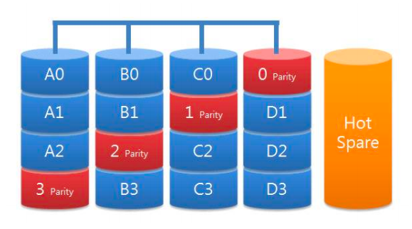

# 보조기억장치

## 07-1 다양한 보조기억장치

### 하드 디스크
- **자기적인 방식**으로 데이터를 저장하는 보조기억장치 (자기 디스크)
- 플래터: 실질적으로 데이터가 저장되는 곳, 수많은 N극과 S극을 저장 (**N극 - 0, S극 - 1**)
- 스핀들: **플래터를 회전**시키는 구성 요소
- 헤드: 플래터를 대상으로 **데이터를 읽고 쓰는** 구성 요소
- 디스크암: **헤드를 원하는 위치로 이동**시키는 구성 요소

### 플래터 구조

- 트랙: 플래터를 여러 동심원으로 나누었을 때 그중 하나의 원
- 섹터: 트랙의 한 조각, 하드 디스크의 가장 작은 전송 단위
- 실린더: 여러 겹의 플래터 상에서 같은 트랙이 위치한 곳을 모아 연결한 논리적 단위

### 데이터 접근 시간
- 탐색 시간: 접근하려는 데이터가 저장된 트랙까지 **헤드를 이동시키는 시간**
- 회전 지연: 헤드가 있는 곳으로 **플래터를 회전시키는 시간**
- 전송 시간: 하드 디스크와 컴퓨터 간에 **데이터를 전송하는 시간**

### 다중 헤드 디스크
- 플래터의 한 면당 헤드가 하나씩 달려 있는 하드 디스크
- 헤드를 데이터가 있는 곳까지 움직여야 하기 때문에 **이동 헤드 디스크**라고도 부른다.

### 고정 헤드 디스크
- 헤드가 트랙별로 여러 개 달려 있는 하드 디스크 (트랙마다 헤드가 있기 때문에 탐색 시간 = 0)
- 헤드를 움직일 필요가 없기 때문에 **고정 헤드 디스크**라고도 부른다.

### 플래시 메모리
- 전기적으로 데이터를 읽고 쓸 수 있는 반도체 기반의 저장 장치
- 셀: 데이터를 저장하는 가장 작은 단위
- SLC: 한 셀에 **1비트**를 저장할 수 있는 플래시 메모리
- MLC: 한 셀에 **2비트**를 저장할 수 있는 플래시 메모리
- TLC: 한 셀에 **3비트**를 저장할 수 있는 플래시 메모리
- 같은 용량의 플래시 메모리 저장 장치라고 할지라도 셀의 타입에 따라 수명, 가격, 성능이 다르다.

| 구분 | SLC | MLC | TLC |
| --- | --- | --- | --- | 
| 셀당 bit | 1bit | 2bit | 3bit |
| 수명 | 길다 | 보통 | 짧다 |
| 읽기/쓰기 속도 | 빠르다 | 보통 | 느리다 |
| 용량 대비 가격 | 높다 | 보통 | 낮다 |

### 플래시 메모리 구조

- 페이지: **셀**들이 모여 만들어진 단위
- 블록: **페이지**가 모여 만들어진 단위
- 플레인: **블록이** 모여 만들어진 단위
- 다이: **플레인**이 모여 만들어진 단위

### 페이지 상태
- Free: 어떠한 데이터도 저장하고 있지 않아 새로운 데이터를 저장할 수 있는 상태
- Valid: 이미 유효한 데이터를 저장하고 있는 상태
- Invalid: 쓰레기값이라 부르는 유효하지 않은 데이터를 저장하고 있는 상태
- 가비지 컬렉션: 유효한 페이지들만을 새로운 블록으로 복사한 뒤, 기존의 블록을 삭제하는 기능 (삭제는 블록 단위로 수행되기 때문이다.)

## 07-2 RAID의 정의와 종류

### RAID
- Redundant Array of Independent Disks
- 주로 하드 디스크와 SSD를 사용하는 기술로, 데이터의 안전성 혹은 높은 성능을 위해 여러 개의 물리적 보조기억장치를 마치 하나의 논리적 보조기억장치처럼 사용하는 기술

### RAID 종류
- RAID 레벨: RAID 구성 방법 (e.g. RAID 0, RAID 1, RAID 2, RAID 3, RAID 4, ...)

### RAID 0

- 데이터를 단순히 병렬로 분산하여 저장하는 방식
- 스트라입: 줄무늬처럼 분산되어 저장된 데이터
- 스트라이핑: 분산하여 저장하는 방식
- RAID 0으로 구성된 하드 디스크 중 하나에 문제가 생긴다면 다른 모든 하드 디스크의 정보를 읽는 데 문제가 생길 수 있다는 단점을 가지고 있다.

### RAID 1

- 복사본을 만드는 방식 (미러링)
- 복구가 매우 간단하다.
- 복사본을 만들어야 하기 때문에 하드 디스크 개수가 한정되었을 때 사용 가능한 용량이 적어지는 단점이 있다. 

### RAID 4

- RAID 1처럼 완전한 복사본을 만드는 대신 오류를 검출하고 복구하기 위한 정보를 저장한 장치를 두는 구성 방식
- 패리티 비트: 오류를 검출하고 복구하기 위한 정보
- 새로운 데이터가 저장될 때마다 패리티를 저장하는 디스크에도 데이터를 쓰게 되므로 패리티를 저장하는 장치에 병목 현상이 발생한다는 문제가 있다.

### RAID 5

- 패리티 정보를 분산하여 저장하는 방식 (RAID 4의 병목 현상 해소)

### RAID 6

- 구성은 기본적으로 RAID 5와 같으나, 서로 다른 두 개의 패리티를 두는 방식 (오류를 검출하고 복구할 수 있는 수단이 두 개다)
- 새로운 정보를 저장할 때마다 함께 저장할 패리티가 두 개이므로, 쓰기 속도는 RAID 5보다 느리다.

